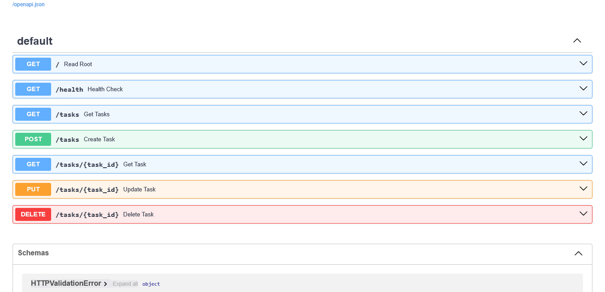

# Task API

## What this is

This project is a small FastAPI application that exposes a simple task management API. It lets you list tasks, retrieve a task by ID, create a new task, update an existing task, and delete a task.

## Why SQLite

SQLite was chosen because this is a small task API that does not need a separate database server. It is lightweight, requires no database configuration or network connection, and stores the complete application database in one portable file. SQLModel also provides a simple way to define the `Task` table and work with SQLite from Python.

## Database location

The database is stored in the project directory as `tasks.db`. The path is configured in `db.py` with the relative SQLite URL `sqlite:///tasks.db`. The file and its tables are created automatically when the application starts.

## Start the project

From the project folder, install the dependencies and start the API:

```bash
pip install fastapi uvicorn sqlmodel
uvicorn main:app --reload
```

Once the server starts, open the Swagger UI at:

```text
http://127.0.0.1:8000/docs
```

## Endpoints

| Method | Endpoint | Description |
| --- | --- | --- |
| GET | `/` | Returns API metadata and available endpoints |
| GET | `/health` | Returns the health status of the API |
| GET | `/tasks` | Returns all tasks |
| GET | `/tasks/{task_id}` | Returns a single task by its ID |
| POST | `/tasks` | Creates a new task |
| PUT | `/tasks/{task_id}` | Updates an existing task |
| DELETE | `/tasks/{task_id}` | Deletes a task by its ID |

## Example `curl -i` output

```bash
curl -i http://127.0.0.1:8000/tasks/999
```

```text
HTTP/1.1 404 Not Found
content-type: application/json

{"detail":"Task not found"}
```

## Database viewer screenshot


## Example SQL query

This query lists every task in the database, including its completion status:

```sql
SELECT id, title, done
FROM task
ORDER BY id;
```

The same query can be run from the SQLite command line with:

```bash
sqlite3 tasks.db "SELECT id, title, done FROM task ORDER BY id;"
```

## Swagger screenshot


